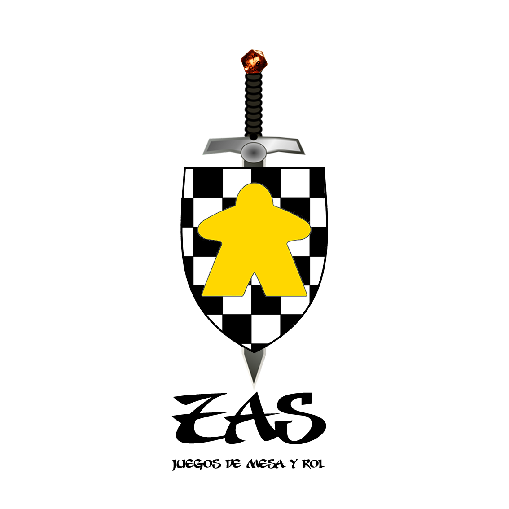

<p align="center">
  
</p>

<p align="center">
  <a href="http://localhost:8000/docs"><strong>📄 API Documentation</strong></a>
</p>

---

## 📚 Table of Contents

- [About](#about)
- [Tech Stack](#-tech-stack)
- [Features & Endpoints](#features--endpoints)
- [Roles & Permissions](#-roles--permissions)
- [Setup & Installation](#-setup--installation)
- [Environment Variables](#-environment-variables)
- [API Documentation](#-api-documentation)
- [Postman Collection](#-postman-collection)
- [Upcoming Improvements](#-upcoming-improvements)

---

## About

**Board Games API** is a RESTful API built with Laravel 12 designed to manage board games, sessions, and matches between users.

It includes authentication, role-based access control, and advanced features such as session participation, game tracking, and statistics.

All endpoints follow REST conventions and are versioned under:


---

## 💻 Tech Stack

- **Runtime:** PHP 8.2
- **Framework:** Laravel 12
- **Authentication:** Laravel Passport (auth:api)
- **Database:** MySQL
- **Architecture:** RESTful API
- **Testing:** PHPUnit

---

## Features & Endpoints

All endpoints are prefixed with:

/api/v1/


---

### 🔐 Authentication

- `POST /login` → Authenticate user  
- `POST /register` → Register new user  
- `POST /logout` → Logout *(requires auth)*  

---

### 👤 Users

| Method | Endpoint | Description | Access |
|--------|----------|------------|--------|
| GET | `/users` | List all users | admin, junta |
| GET | `/users/{id}` | Get user detail | admin, junta |
| POST | `/users` | Create user | admin |
| PUT | `/users/{id}` | Update user | owner / admin |
| DELETE | `/users/{id}` | Delete user | admin |

---

### 🎲 Boardgames

| Method | Endpoint | Description | Access |
|--------|----------|------------|--------|
| GET | `/boardgames` | List all board games | authenticated |
| GET | `/boardgames/{id}` | Game details | authenticated |
| POST | `/boardgames` | Create game | admin, junta |
| PUT | `/boardgames/{id}` | Update game | admin, junta |
| DELETE | `/boardgames/{id}` | Delete game | admin, junta |

---

### 🧩 Types (Game Categories)

| Method | Endpoint | Description | Access |
|--------|----------|------------|--------|
| GET | `/types` | List types | admin, junta, partner |
| GET | `/types/{id}` | Type detail | admin, junta, partner |
| POST | `/types` | Create type | admin, junta |
| PUT | `/types/{id}` | Update type | admin, junta |
| DELETE | `/types/{id}` | Delete type | admin |

---

### 🧑‍🤝‍🧑 Zassessions (Game Sessions)

| Method | Endpoint | Description | Access |
|--------|----------|------------|--------|
| GET | `/zassessions` | List sessions | authenticated |
| GET | `/zassessions/{id}` | Session detail | authenticated |
| POST | `/zassessions` | Create session | admin, junta |
| PUT | `/zassessions/{id}` | Update session | admin, junta |
| DELETE | `/zassessions/{id}` | Delete session | admin, junta |
| POST | `/zassessions/{id}/join` | Join session | authenticated |
| DELETE | `/zassessions/{id}/leave` | Leave session | authenticated |
| GET | `/zassessions/{id}/users` | Session users | authenticated |

#### 📊 Session Stats
- `GET /zassessions/stats` → Global stats *(admin, junta, partner)*
- `GET /zassessions/{id}/stats` → Session stats *(admin, junta, partner)*

#### 🎮 Session Games
- `GET /zassessions/{id}/games` → Games in session *(all roles)*

---

### 🎮 Games (Matches)

| Method | Endpoint | Description | Access |
|--------|----------|------------|--------|
| GET | `/games` | List all matches | admin, junta, partner |
| GET | `/games/{id}` | Match detail | authenticated |
| POST | `/games` | Create match | admin, junta, partner |
| PUT | `/games/{id}` | Update match | admin, junta |
| DELETE | `/games/{id}` | Delete match | admin, junta |
| POST | `/games/{id}/join` | Join match | authenticated |
| DELETE | `/games/{id}/leave` | Leave match | authenticated |
| GET | `/games/{id}/users` | Match users | authenticated |

#### 📊 Game Stats
- `GET /games/{id}/stats` → Match stats *(admin, junta, partner)*

---

## 🔐 Roles & Permissions

The API implements **role-based access control**:

- **admin** → Full access
- **junta** → Management permissions
- **partner** → Limited read + stats
- **guest** → Basic participation

---

## 🔧 Setup & Installation

### Prerequisites

- PHP >= 8.2
- Composer
- MySQL

---

### Clone repository

```bash
git clone https://github.com/tu-usuario/boardgames-api.git
cd boardgames-api

Install dependencies
composer install

Configure environment
cp .env.example .env
php artisan key:generate

Run migrations
php artisan migrate
Start server
php artisan serve

API available at:

http://localhost:8000/api/v1/

Run tests
php artisan test

## 🔑 Environment Variables
APP_NAME=ApiZas
APP_ENV=local
APP_KEY=
APP_DEBUG=true
APP_URL=http://localhost:8000

DB_CONNECTION=mysql
DB_HOST=127.0.0.1
DB_PORT=3306
DB_DATABASE=apizas
DB_USERNAME=root
DB_PASSWORD=

## 📖 API Documentation
Generate documentation (if using Scribe):

php artisan scribe:generate

Then visit:

http://localhost/public/docs/

'''
## 📮 Postman Collection
You can test the API using Postman.

Steps:
1. Import your collection
2. Set base URL:
http://localhost:8000/api/v1
3. Authenticate using:
 POST /login
 POST /register
4. Use the Bearer token for protected routes

## 🚧 Upcoming Improvements
Pagination for listings
Advanced filters (players, type, difficulty)
Improved stats system
Notifications for sessions
Image uploads for board games